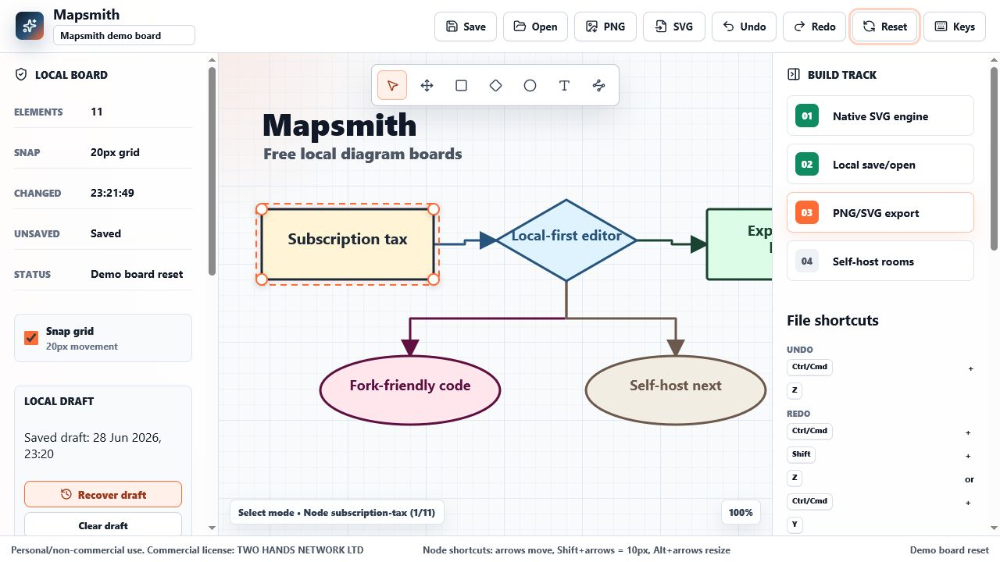
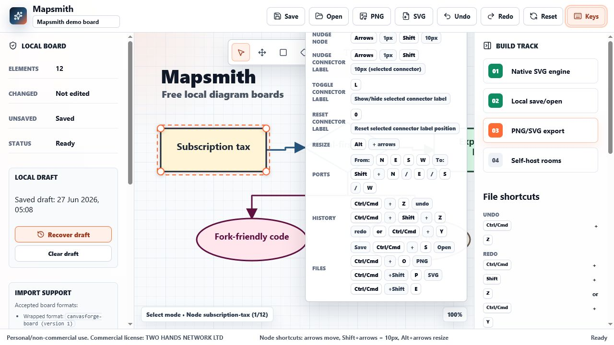
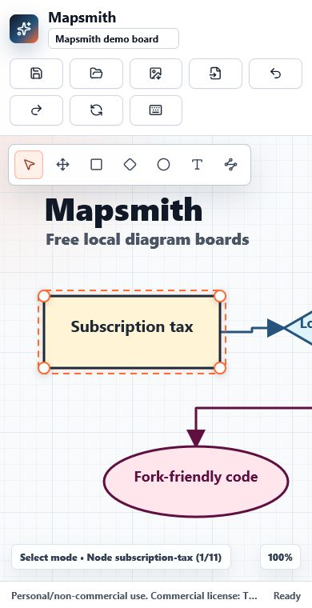

# Mapsmith

[](https://github.com/Martin123132/mapsmith/actions/workflows/ci.yml)

Mapsmith is a local-first, open-source diagram editor for fast visual maps, whiteboards, and flow sketches. It runs in the browser, keeps boards in local files, and exports native SVG-based work without a subscription gate.



## Why Mapsmith

- Local-first boards: save and reopen `.mapsmith` files from your machine.
- Native SVG canvas: shapes, labels, connector lines, ports, pan, zoom, and keyboard controls.
- Practical exports: save board JSON and export PNG or SVG snapshots with
  timestamped, board-aware filenames.
- No account requirement: the core editor is designed to work without cloud lock-in.
- Open-source posture: AGPL-3.0-only, with a public roadmap and visible CI.

## Current MVP

Mapsmith currently includes:

- Shape, text, and connector tools
- Selection, drag movement, resize handles, and keyboard nudging
- Named connector ports for north, east, south, and west attachment points
- Shortcut help overlay for selection, nudge, resize, ports, save, open, and export
- Local `.mapsmith` save/open flow with legacy `.canvasforge` import support
- Deterministic board JSON round-trip verification
- PNG and SVG export with board-aware, timestamped filenames
- Inline board title editing (keeps exported names aligned to the active board)
- Connector port editing and optional connector labels
- Local draft auto-save with one-click recovery and clear controls
- Starter templates for blank, flowchart, system map, and process map
- Responsive editor layout for desktop and small screens



## File Compatibility

New saves use the `.mapsmith` extension. The JSON board payload intentionally keeps the legacy `canvasforge-board` type marker so existing `.canvasforge` files continue to import without migration. For compatibility, raw legacy Mapsmith board JSON objects can also be imported when no wrapper type/version fields are present.

See [examples/](examples/) for a tiny synthetic `.mapsmith` board and checked [open/export/save walkthrough](examples/WALKTHROUGH.md).

## Roadmap

The short version:

- Improve connector routing and label editing
- Add richer board templates and example diagrams
- Improve export naming and add more fixture coverage
- Add import/export hardening tests
- Package a stable first public release

See [ROADMAP.md](ROADMAP.md) for the focused public roadmap.

## Development

Contributor guidance lives in [CONTRIBUTING.md](CONTRIBUTING.md). Security reporting guidance lives in [SECURITY.md](SECURITY.md).

Install dependencies:

```bash
npm ci
```

Run the development server:

```bash
npm run dev
```

Run repository checks:

```bash
npm run lint
npm run build
npm run audit
npm run verify:board
npm run verify:examples
npm run verify:svg
```

For a production-like local smoke after `npm run build`:

```bash
npm run preview -- --host 127.0.0.1
```

## Mobile Smoke

The editor is designed around desktop creation, but the shell should remain readable and usable on small screens.



## License

Mapsmith is licensed under [AGPL-3.0-only](LICENSE).

Future release preparation is tracked in [docs/RELEASE_CHECKLIST.md](docs/RELEASE_CHECKLIST.md).
